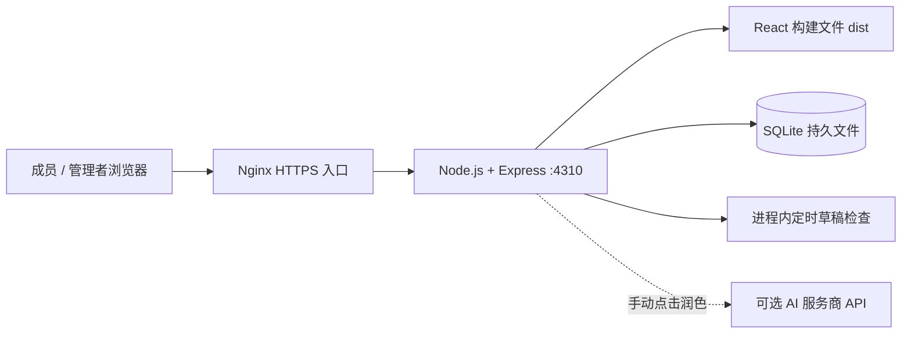

# 天枢实验室：服务与部署手册

37 服务器直接内网 HTTP 访问采用独立的 [内网部署配置与操作说明](intranet-deployment.md)，默认地址为 `http://192.168.0.37:4310`。本文保留原 HTTPS 反向代理部署流程。

## 当前架构



| 组成 | 是否单独部署 | 作用 |
|---|---|---|
| React 网页 | 否，构建后由 Express 提供 | 概览、计划、任务、项目、成员、报告页面 |
| Express API | 必须，一个常驻 Node 进程 | 登录会话、权限、审核发布、周执行、成果验收、导出 |
| SQLite | 无数据库服务，挂载数据目录 | 账号、会话、项目、任务、审计、发布版本与报告快照 |
| 定时草稿 | 否，与 API 同进程 | 每30秒检查已启用的生成规则，默认关闭 |
| AI 润色 | 可选外部服务 | 用户手动触发后发送报告事实；不参与统计计算 |
| Nginx | 正式 HTTPS 部署的入口 | TLS 终止、反向代理，仅开放80/443 |
| Vite :5173 | 只用于开发 | 热更新与API代理，正式部署不运行 |

这是单部门、单实例应用。不要启动多个共享同一数据库的应用副本，也不要把 SQLite 文件放到网络共享盘。当前没有独立任务队列、Redis、MySQL、邮件/飞书通知服务或文件上传存储服务。

## 建议的正式部署方式

使用一台常驻 Linux 服务器，安装 Docker Engine、Compose 插件和 Nginx。代码已提供 `Dockerfile`、`compose.yaml`、`deploy/production.env.example` 和 `deploy/nginx.conf.example`。镜像使用 Node.js 24.20.0 LTS；应用最低兼容版本仍为24.14。不要把当前办公电脑上的临时进程当作部门正式服务器。

### 1. 拉取代码并启动本机入口

使用有权限访问私有仓库的 Git 身份认证，不把访问令牌写到仓库地址里。

```sh
git clone https://github.com/zqYuan98/lab-planning.git
cd lab-planning
cp deploy/production.env.example .env
docker compose config --quiet
docker compose up -d --build
docker compose ps
docker compose logs --tail=100 app
```

初始模板只把容器端口映射到服务器 `127.0.0.1:4310`，使用命名卷 `lab-planning-data`。配置了容器异常退出后重启、启动健康检查、15秒优雅退出时间及日志大小限制。主机必须让 Docker 服务开机启动。健康检查能标记异常，但不等于自动重启一个仍在运行却不健康的进程；需要运维监控处理这种情况。

### 2. 首次创建管理员

在自己的电脑建立到服务器的 SSH 隧道：

```sh
ssh -N -L 4310:127.0.0.1:4310 your-ops-user@your-server
```

本地4310需空闲；访问 `http://127.0.0.1:4310` 完成管理员初始化，再由管理员添加成员。模板中的 `APP_ORIGIN` 与此地址一致。在初始化完成前不要把站点开放到公共入口。若迁移现有数据，先恢复备份，不要再初始化新管理员。

### 3. 切换为 HTTPS 站点

准备自己的域名和有效证书，将 Nginx 模板中的域名、证书路径替换为实际值。然后编辑服务器项目根目录的 `.env`：

```dotenv
APP_ORIGIN=https://planning.your-company.example
COOKIE_SECURE=true
```

`APP_ORIGIN` 必须是浏览器实际访问的协议、域名和端口，不附带路径，也不能同时使用若干不同域名访问。服务端按这个地址检查写入请求来源。

反向代理必须覆盖 `X-Forwarded-For`，不能直接透传客户端伪造的值。Nginx 与 Node 直接运行在同一主机时，可设置 `TRUST_PROXY=loopback`。本手册的 Docker 场景需确认 Node 实际看见的代理来源IP，通常是容器网络网关：

```sh
docker inspect --format '{{range .NetworkSettings.Networks}}{{.Gateway}}{{end}}' "$(docker compose ps -q app)"
```

把实际网关IP以 `/32` 加入 `.env` 的 `TRUST_PROXY`，例如 `172.18.0.1/32`。这个地址只是例子，不能照抄；实际拓扑有多层代理时应由运维逐层确认。默认 `false` 不信任转发头，也不接受 `true` 或无边界的跳数配置。Nginx模板适用于单层代理。

```sh
docker compose up -d
sudo nginx -t
sudo systemctl reload nginx
```

确认外部 HTTPS 页面能正常登录、提交和导出；外部不应直接访问4310。通过受控网络和站点入口限制可访问人群。

### 4. 开启需要的业务功能

管理员先建立项目和成员，成员提报月计划，管理员审核整理发布，成员再拆周任务。报告规则生成和Word导出无需AI密钥。

自动草稿需在报告中心主动开启。进程停机跨过整个触发日会错过生成，恢复后需手动补生成。它只保存系统内草稿，不对外发消息，也不会自动定稿。

如需AI润色，配置服务端 `AI_BASE_URL`、`AI_MODEL`、`AI_API_KEY` 后重新创建容器。确认该服务商允许接收部门报告事实，再在报告页手动点击润色。配置本身不会发送数据。

## 更新、备份与恢复

更新前在线备份，使用每次不同的文件名：

```sh
docker compose exec -T app npm run backup -- /app/data/backups/before-upgrade-20260908.sqlite
mkdir -p ../lab-planning-backups
docker compose cp app:/app/data/backups/before-upgrade-20260908.sqlite ../lab-planning-backups/before-upgrade-20260908.sqlite
git pull --ff-only
docker compose up -d --build
docker compose ps
```

备份脚本使用SQLite在线备份和完整性检查，包含账号和全部业务数据。示例将副本放在代码仓库之外；构建规则也排除了数据库文件，避免进入镜像构建上下文。应定期复制到另一台机器或受控备份存储，不能只留在同一块磁盘。Compose 不会自动执行定期备份；需要运维设置备份任务和保留期限。

恢复时停止应用，保留现有库及WAL副本。将已校验备份放到新的数据目录/命名卷，确保容器 `node` 用户有读写权限，通过 `DATA_VOLUME_NAME` 和 `DATABASE_PATH` 指向恢复副本。先用独立端口核验登录、项目、计划与报告，再切换正式入口。不要覆盖唯一的现有库；不要使用会删除数据卷的清理命令。

## 不使用 Docker 时

安装 Node.js 24.20.0 LTS，安装完整依赖并构建：

```sh
npm ci --include=dev
npm run build
npm start
```

正式环境设置 `NODE_ENV=production`、`HOST=127.0.0.1`、`PORT=4310`、持久的 `DATABASE_PATH`、实际 `APP_ORIGIN`，再由系统服务管理器托管 Node 进程，并配置 HTTPS 代理。`tsx` 目前属于开发依赖但也是启动器，因此不能直接使用 `npm ci --omit=dev`；容器镜像已包含启动所需依赖。不要运行 `npm run dev` 作为正式服务。

## 发布验收

- 已初始化管理员，普通成员无法管理账号、审核他人计划或生成部门报告。
- 网页、API、Word导出正常；重启后账号、项目和报告仍在。
- HTTPS来源和Cookie设置一致；代理只信任已核实的IP/CIDR。
- 已备份且做过恢复演练；确认数据盘容量和应用日志。
- 检查定时草稿启用状态、触发时间和停机补报方式。

[本轮 CI](https://github.com/zqYuan98/lab-planning/actions/runs/34230218993) 已通过Linux环境的测试/构建、Compose配置解析、生产镜像构建、真实容器静态页面/API/Word验证、在线备份与重启持久化验证。本机未安装Docker，容器运行证据由CI提供；Nginx模板需在实际域名与证书环境执行 `nginx -t` 和HTTPS验收。

参考：[Docker单机生产部署](https://docs.docker.com/compose/how-tos/production/)、[Nginx反向代理模块](https://nginx.org/en/docs/http/ngx_http_proxy_module.html)、[Node.js 24.20.0 LTS](https://nodejs.org/en/blog/release/v24.20.0)。
