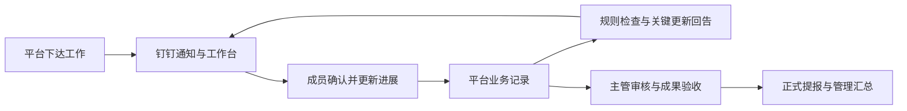

# 平台与钉钉协作第二阶段：总体设计

版本：1.0，2026-09-19，完整评审稿，已通过独立技术审阅，待用户业务审阅。依据：[9 月 19 日自检](../../dingtalk-self-check-2026-09-19.md)。本次只交付设计，未修改生产代码、数据、外发规则，也未实施新功能。

## 1. 目标与工作模式

补齐“下达 → 确认 → 执行 → 催更新 → 回应 → 审核/验收 → 汇总”的闭环。平台保存唯一业务事实，钉钉承担入口、通知和经过授权的操作界面；每次钉钉操作最终仍调用平台同一业务服务。

成员主要从钉钉“天枢实验室”进入“我的工作”，查看今日事项、待回应催办、待正式提交内容，填写实际进展和成果。管理者在平台安排工作、审阅进展、处理阻塞、验收成果和管理提醒规则。关键变化通过钉钉回告，普通频繁保存进入汇总。

业务状态独立保留：消息投递、系统查看、安排确认、催办回应、任务执行、成果验收、正式周提报。不能用钉钉已读、卡片点击或原生待办打勾替代这些事实。

## 2. 三种路线与选择

| 路线 | 内容 | 优点 | 代价 |
| --- | --- | --- | --- |
| A，推荐 | 完善钉钉内 H5 业务闭环，再逐步添加卡片、原生待办、聊天入口 | 复用现有权限与数据；最快完成真实业务闭环；渠道故障不阻塞业务 | 部分操作需要点开页面 |
| B | 首期同时接入原生待办和卡片写操作 | 钉钉内操作更短 | 必须先验证租户能力、身份映射、回调、冲突和恢复，扩大首期范围 |
| C | 只补通知模板和定时提醒 | 改动少 | 无法记录催办回应、处理进度冲突，不满足完整目标 |

按 A 编排，但方案完整覆盖 B 的能力。已向用户询问首期优先范围；若尚未回复，A 是设计默认，不代表已经批准开发。默认参数可以在实施前调整，不据此更改线上配置。

## 3. 当前约束

- 2026-09-19 快照：通知范围 5 人、4 人已绑定；陈圣阳未绑定。两条通知有平台成功回执，不能推定全员实机验收完成。
- 现有技术：单实例 Node/Express、React、SQLite entities、进程内定时器和持久投递队列。继续使用，不引入微服务、Redis、通用工作流引擎或全量通讯录系统。
- 用户只有 manager/member；项目负责人不是主管或审核人，不从 position、项目负责人或姓名猜管理关系。
- Task.status 与 WeeklyRecord.status 独立。WeeklyRecord.submitted 表示单条生效；正式整份周提报由 WeeklySubmission 及其不可变回执代表。
- Task 没有最后有效进展、阻塞开始时间、主管字段、取消/归档状态、百分比或小时级截止时间。这些不得凭 updatedAt 推断。
- MonthlyPlan 已有成果提交/验收状态；复用现有月度成果接口。报告当前仅管理者可读，不因发通知放宽给全员。

## 4. 设计包与边界

为避免把多个独立能力混成一次发布，拆成三个可分别制定实施计划的设计包。

| 包 | 文档 | 交付范围 |
| --- | --- | --- |
| P0 基础修复与运行保障 | [P0 设计](2026-09-19-dingtalk-foundation-design.md) | 确认提醒、草稿误发、钉钉入口、身份一致性、投递停机与诊断、备份 |
| P1 平台业务闭环 | [P1 设计](2026-09-19-progress-followup-design.md) | 进展记录、催进度、自动规则、更新回告、审核/验收通知、摘要、页面与接口 |
| P2 钉钉原生增强 | [P2 设计](2026-09-19-dingtalk-native-actions-design.md) | 交互卡片、待办同步、聊天入口、组织事件；各能力独立开关和验收 |

顺序：P0 → P1A 进展与催办 → P1B 自动提醒、回告与必要的最小主管摘要 → P1C 完整日/周摘要与运维验收 → P2 按能力逐个启用。P1B 的风险升级和超额关键事件已有可用摘要路径，不依赖 P1C；后续扩充复用去重记录。P2 的只读能力验证可与 P1 并行，但不能成为 P1 上线的依赖。

## 5. 功能范围

| 用户场景 | 目标行为 | 阶段 |
| --- | --- | --- |
| 收到提醒后确认原安排 | 一步找到当前有效原安排并本人确认 | P0 |
| 导入草稿 | 预览/保存草稿不提前通知，显式发布才通知 | P0 |
| 在钉钉里直接打开 | 工作台、通知和后续待办链接进入同一受控事项页面 | P0 |
| 主管催成员更新进度 | 有要求、期限、回应和逾期事实的独立催办 | P1A |
| 成员更新、完成、受阻 | 记录不可变进展；关键变化通知指定管理者，普通更新汇总 | P1A/B |
| 临期、到期、逾期、久未更新 | 按规则检查当前有效工作，合并提醒，状态改变及时停止 | P1B |
| 阻塞升级和延期 | 成员说明需要的帮助或申请新期限，主管处理，保留原事实 | P1B |
| 普通目标审核、成果验收 | 补齐已有业务动作的通知，不创建第二套审批状态 | P1B |
| 周提报成功回告 | 本人有站内回执，管理者收汇总；不将保存单条当成提交 | P1B |
| 每日管理摘要、定稿报告通知 | 按权限和实际变化汇总，无更新不空发 | P1C |
| 直接在卡片/聊天操作 | 结构化意图、身份和版本校验、明确确认后调用平台服务 | P2 |
| 钉钉原生待办 | 平台待办的外部投影，完成信号须验证实际业务条件 | P2 |
| 离职/停用联动 | 受验证的组织状态事件触发渠道隔离及会话访问控制 | P2 |

不纳入本次：短信/电话加急、部门群公开催交名单、AI 自主改任务或验收、绩效打分、全量组织重建、多租户改造。它们不是实现本次工作闭环的必要条件。

## 6. 推荐默认规则

| 项目 | 设计默认 |
| --- | --- |
| 时区 | Asia/Shanghai；存储 UTC，界面显示北京时间 |
| 总外发时段 | 沿用 08:00–20:00；时段外站内立即可见、钉钉等待；不自动改成全天 |
| 新增自动催办日历 | 周一至周五，支持管理员配置调休/假期例外；不是已同步法定节假日 |
| 临期 | 截止日前一个工作日 17:00 |
| 当日到期 | 截止当日 09:00，若为工作日 |
| 逾期 | 截止日次日起，工作日 09:00 合并；第 3 个逾期工作日首次升级给主管 |
| 久未更新 | 满 3 个完整工作日没有有效成员进展，次工作日 09:00 检查 |
| 阻塞 | 首次受阻及时回告；满 2 个完整工作日未解除，次工作日 09:00 升级 |
| 普通进展摘要 | 工作日 17:30，默认只向指定管理者发送有变化的摘要 |
| 周提报 | 保留周五 09:00、15:00、16:05 和现有正式截止事实，不因新增日历静默改变 |

这些是推荐值，详细起算、合并、冷却、重复和停止规则以 P1 为准。个人偏好只关闭可选摘要；组织要求的催办在界面明确标明，仍受总发送时段和频率上限约束。

## 7. 总体架构与一致性

业务命令经原权限校验，在同一同步数据库事务内写业务记录、审计、业务事件、接收人站内消息与外发意图。网络请求在事务提交后执行。事件包含 actor、来源、对象和实质版本，不复制整份业务快照到通知。

继续保留工作通知现有 accepted/delivered/unknown 语义。其他渠道使用各自状态，不把“待办已创建”“卡片已更新”显示为“成员已处理”。提供统一操作关联号追踪，但不合并不同业务事实。

回调先验来源和身份、持久化去重，再通过同一平台命令执行；平台主动同步产生的回调不得循环生成新通知。业务提交成功而钉钉暂时不可用时，平台保留结果并显示同步状态，不能回滚已完成业务操作。

## 8. 开关、迁移和灰度

新功能全部独立开关，默认关闭。P0 修复保留原通知范围；P1/P2 按明确成员和功能逐项开启。陈圣阳的本人绑定仍需由本人完成。

存量任务不在升级启动时自动扫描群发。管理员看到“纳入督办预览”，核对对象、成员、规则和预计数量，显式纳入后以 enabledAt 建立观察起点。未纳入历史任务继续可用原业务功能。业务导入、恢复、备份克隆均不得重放外发事件。

迁移先备份并验证，新记录采用向后兼容字段和独立实体；若引入新表/索引并升级 STORAGE_VERSION，须同时提供兼容新库的回退版本，不能直接回滚到当前拒绝未来库版本的旧程序，更不能用旧库覆盖上线后新业务。

灰度顺序：隔离模拟验证 → 当前管理者本人 → 经确认的两名成员 → 当前已绑定范围 → 其余成员。每步检查通知数量、接收范围、事项定位和实际操作；不得为测试未经授权地向真实成员发消息。

## 9. 验收与成功标准

- 首次下达、再次变更、手动催进度、成员回应、主管回告、成果验收、正式周提报各走通一次，并证明状态独立。
- 重复点击、重复回调、进程重启、断网、时段切换和恢复旧数据，不产生业务重复或历史群发。
- 在发送时段内、外部服务正常、50 条以内本地待发队列下，站内事件即时提交，普通事件 60 秒内启动投递；这是验收目标，不是钉钉保证送达时长。
- iOS、Android、Windows/macOS 的实际可用客户端逐项验收；不支持的动作明确降级 H5，保留目标。
- 转发卡片、陈旧卡片、身份切换、解绑、停用、成员变化都不得越权。
- 原有全套测试继续通过，新增用例覆盖各子设计边界。现有 300 项通过仅是基线，不作为新功能已完成的证据。

## 10. 需用户审阅的设计选择

建议首期采用 A；总时段沿用 08:00–20:00；主管通知接收人必须从现有有效管理者中明确指定；新催办按工作日日历，原周提报规则保持原样；普通进度集中汇总，完成/阻塞/延期等关键动作及时回告。

上述默认可调整。当前交付是可审阅方案；开发、部署及功能启用需后续任务明确范围后推进。本次不进入实施。
