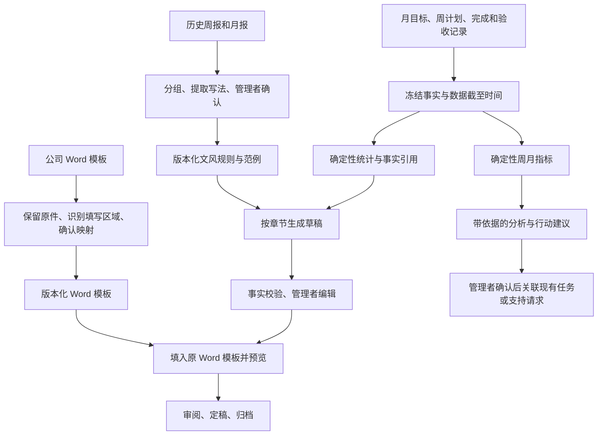

# 报告智能体：历史学习、Word 模板换版与周月分析

日期：2026-09-21。状态：供用户审阅的模块设计草案；已通过独立设计审查，尚未实施、未改动运行代码、未部署。

用户已确认：最终交付为 Word，字体、表格、页眉页脚等要沿用公司模板。历史周报和月报用于学习格式与写法；本期报告结合系统月度目标、周计划及实际完成情况生成；每周和每月另外形成内部分析报告。

参考文件：[原始设计文档](C:/Users/24830/Downloads/2026-09-21-report-template-learning-design.md)。该文件作为待评估的方案输入，不视为已生效规则。本草案保留其中的事实快照、模板版本、章节生成与独立分析方向，并修正版式保留、指标解释和自动作业方面的缺口。

## 1. 产品决策与范围

建议在现有「报告中心」内增加一个报告智能体，提供「报告」「模板与范例」「周月分析」「自动生成设置」四个入口。共用现有管理者权限和 AI 连接配置。

用户不必为几个不同智能体来回切换。内部由可检查的步骤完成学习、取数、写作、校验与排版；每一步都有输入、结果和失败退路。

| 方案 | 使用效果 | 取舍 |
| --- | --- | --- |
| **推荐：原 Word 模板保留 + 明确内容区域 + AI 分章节撰写** | 原版式承载新数据，公司换模板后重新确认映射即可复用 | 需要建设 DOCX 模板处理和预览能力，先验证真实样本 |
| 章节配置 + Markdown 转 Word | 章节、顺序和列可灵活调整，复用现有导出容易 | 当前导出会重新创建字体、页脚、表格，不能满足严格沿用原版式的要求 |
| 每次把历史报告和当前数据交给模型整篇生成 | 上手快，适合作人工辅助草稿 | 模板复用、事实核对、稳定排版和历史复现难以形成可靠流程 |

一期不做模型微调。把可修改的模板、已确认的写作规则和少量相应章节范例作为学习成果保存，更方便公司换版和管理者纠正。后续是否需要训练模型，应由真实样本和评测决定。

自动生成的终点是「待审阅草稿」。定稿、采用新模板、采纳写作规则和把分析建议变成工作安排，都有具体内容供管理者确认。自动生成不自动发送给公司或钉钉。

## 2. 两条产出线、四种内容来源

**公司周报／月报**：按指定 Word 模板交付，突出成果、目标进展、问题和下期安排；管理者核对后定稿。

**内部周／月分析**：关注执行情况、验收进展、关联缺口、提报情况与需协调事项，使用独立简洁模板。默认不进入公司报告；公司确实要求某项分析时，按明确字段绑定加入，不能把内部分析整篇隐含塞入公司文件。

| 来源 | 允许用途 | 禁止混用 |
| --- | --- | --- |
| 公司最新空白模板或指定基准文件 | 版式、章节、表格和填写要求 | 模板示例值不能当本期事实 |
| 管理者选定的历史成品报告 | 语气、详略、组织方式与范例 | 历史成果、姓名、数字、问题不能挪到本期 |
| 当前系统冻结事实 | 月目标、有效周记录、完成与验收、提报、明确关联 | 计划不当成果，周阶段完成不当整项完成或月度验收 |
| 管理者当期补充 | 系统未覆盖的公司必填内容，注明来源并审核 | 不自动写回业务状态、不混入系统指标分母 |

管理者补充以报告级记录保存，包含字段、值或说明、来源、填写者、时间和确认状态，随报告冻结。例如模板新加“预算执行”，而系统无预算数据时，标记「需人工补充」；不能用工作数量估算预算。补充内容进入正文时可追溯，系统统计仍只来自业务记录。

## 3. 首次学习：上传后能看懂它学到了什么

1. 在「模板与范例」选择周报或月报，上传公司模板和历史成品报告；文件分别标记「版式基准」「写法参考」。一份文件可兼具两种用途，但用途必须明确。
2. 系统按报告类型、周期和结构分组，显示重复文件、不同模板年代和识别不确定项。周报范例与月报范例分别管理；文件日期仅作识别建议，允许管理者修正。
3. 管理者指定本次采用的公司模板。如果只有历史成品，就选一份作为版式基准，系统把具体人名、月份、成果、表格数据等识别为待替换区域，逐项确认后形成干净模板。无法确认的示例正文不得原样留在生产模板。
4. 系统展示「学到的章节」「建议对应的数据」「写作习惯」「待确认项」。比如“按项目分组、先讲成果再讲问题、每点控制在两三句话”。不是只给出一个无法检查的“学习完成”状态。
5. 用现有某一期数据试生成，预览原模板和结果；检查通过后选择适用起始周／月份并启用。

首次建议准备一份当前模板和几份认可的成品报告；只有一份也可开始，学习结论标注样本较少。不要求为了凑样本导入质量差或过时的报告。

一期接受 `.docx`，单文件建议上限 12 MiB、解压后 40 MiB，每批最多 10 份逐文件上传；这是拟定配置，需在真实样本验证后调整，并配套只覆盖该路由的代理限制。旧 `.doc`、PDF、加密文件在上传前给出格式说明，转换为 DOCX 后继续，不静默猜测版式。

历史文件默认只进入范例库，不创建计划、任务、完成状态或历史统计。若另需补录历史业务，进入现有业务导入流程单独核对。

## 4. Word 原版式保留与模板换版

### 4.1 实现原则

保留上传 DOCX 原件，另存一份准备好的可填充模板；在模板副本中标记标题、正文段落、表格重复行、日期等内容区域。后台只对确认区域写入文本或克隆行，保留区域外的字体设置、样式、页眉页脚、节设置、页边距、Logo、编号和表格属性。

可采用 Word 内容控件作为区域标记，明确文本块和重复行的范围；使用受控 XML 操作填入数据，避免以普通字符串替换整个文件。Word 的内容控件可承载结构化内容和重复段落／表格行，相关机制见 [Microsoft 内容控件文档](https://learn.microsoft.com/en-us/office/client-developer/word/content-controls-in-word)。DOCX 的正文、样式、页眉、页脚等属于不同文档部件，保留方案据此组织，见 [Microsoft WordprocessingML 结构说明](https://learn.microsoft.com/en-us/office/open-xml/word/structure-of-a-wordprocessingml-document)。具体解析库与渲染器在样本验证阶段选定，不在未验证时承诺任意 Word 文件完全兼容。

服务端生成完整内容，交付文件不依赖 Word 打开时再从外部数据源拉取或重新生成正文。若使用内容控件，去掉会重新绑定旧样本数据的关联，防止打开文件时覆盖已填结果。

### 4.2 支持边界与版式验收

首批覆盖普通段落、多级标题、字体字号与段落间距、页眉页脚及页码、内嵌 Logo、节和页面属性、普通表格、固定合并表头、明确的数据重复行。复杂嵌套表格、跨重复区域的纵向合并、浮动文本框中的动态内容、自动目录、嵌入对象及动态图表先检查并标注，未通过验证的区域不能宣称自动支持。

历史文件可能带批注、修订、隐藏文字、外部链接和旧示例数据。解析时不执行其中内容、不拉取外链；保留受权限保护的原件，对用于学习与交付的副本展示清理清单。管理者选择接受修订后的正文等处理方式，避免把旧批注或隐藏数据带入新报告。

预览至少检查缺失字体、标题孤行、表格溢出、合并单元格、行跨页、页眉页脚、编号和未替换区域。文字增长引起正常换页，不强求与空模板页数相同；禁止通过静默截断文字或自动缩小字体来“保住页数”。

样本验证记录采用的 Word 客户端和预览渲染环境。缺字体或不支持对象时，预览明确标记，并提供试填 DOCX 核对；未完成该模板版式核验前不能自动启用正式输出。不能保证不同客户端、字体环境下逐像素一致。

### 4.3 模板与字段绑定

每个区域支持五类绑定：固定文字、周期等元信息、确定性数据字段／指标、按行或章节生成的叙述、管理者补充。数据字段为服务端白名单，禁止上传文档提供可执行表达式、任意对象路径或数据库查询。

重复行同时定义数据集、排序、筛选、空数据表现，以及每列的绑定。叙述列必须携带当前行的事实引用；不能把“备注”强行当作一个没有定义的普通字段。必填区域不能因没有数据而静默消失。

有些公司只要几条重点，不能因此遗漏统计范围。后台维护全量事项覆盖清单，列明“已写入正文／已合并概述／附表／未展示及原因”。公司模板不容纳明细时，明细留在系统内核查，不擅自添加破坏版式的附件章节。

### 4.4 公司更新模板

上传新版 → 展示版式和章节差异 → 确认保留／新增／删除／拆分／合并及数据来源 → 试填预览 → 指定适用周期 → 启用。

同名章节也需检查含义是否改变；不凭标题相似就永久继承绑定。拆分和合并的文风范例先列候选，不自动复制激活。新增字段没有系统数据时明确转为人工补充。

周报和月报独立维护模板系列，分别指定适用周期；相同类型同一周期只能解析到一个默认版本。模板版本发布后不可原地修改，修订产生新版本。应用范围内的章节、列和样式变化通过模板换版完成；新增业务数据源、复杂图表或新指标可能需要开发，不能笼统承诺所有改版都免发版。

已生成报告锁定原模板版本。在途任务也使用启动时锁定的模板。管理者选择“按新模板生成新版本”时，界面明确选择沿用原事实快照，还是刷新事实；旧报告及正在编辑的内容不被覆盖。回退模板只改变后续默认选择，保留所有历史引用。

## 5. 报告智能体如何生成

1. **确认范围**：报告类型、周期、模板版本、事实截至时间和使用权限。日期按 Asia/Shanghai 处理。生成过去某月的报告不等于恢复当时月底状态。
2. **冻结事实**：沿用 `ReportSnapshot`。读取月目标、关联任务、有效周记录、成果验收、正式周提报及相关发布版本；保留源 ID、版本和生成时数据。未提交／未生效内容单列，不混入正式统计。
3. **按目标汇集证据**：以本期月目标为主线，关联各周承诺、实际成果、证据、阻塞和下一步。月目标尚未填写成果时，可从关联周记录提出成果摘要草稿，但继续显示原验收状态，不自动把月目标改成完成。
4. **确定性统计**：数量、完成率、验收率、日期和状态由代码计算；跨月周、临时工作、事后补关联按照既有口径注明。多周描述同一成果时，给出合并候选并保留来源；不能把相似文字自动认定为重复成果。
5. **分章节撰写**：模型只接收该章节所需事实与经确认的写法。输出正文及所引用的事实 ID。对重点取舍保留全量覆盖检查，不截断后假称已经汇总全部数据。
6. **校验与修订**：核对来源、数值单位、主体、周期、状态和缺失项。失败只重试相应章节一次；仍失败保留规则草稿和原文，显示原因，其他章节可继续审阅。
7. **填模板与预览**：用确认内容填入选定 Word 模板，显示生成进度、待补充项和版式问题。
8. **管理者定稿**：逐项补齐或说明待确认内容，编辑保存，检查通过后定稿并存储最终文件。刷新数据会产生新报告 revision；单章改写默认沿用本次冻结事实。

交互入口提供“生成本期报告”“仅重写这一节”“查看依据”“刷新数据生成新版本”“导出草稿”“定稿”。正文旁可点开关联计划和周记录，并显示引用的是哪个冻结版本。

草稿和正式文件的下载入口、文件名和归档状态可辨认。存在必填字段缺失、未经确认的人工事实补充、无法支持的事实结论或未解决的版式错误时阻止定稿；缺少证据链接等可解释警告允许管理者记录说明，不以此自动宣布成果已验收。

## 6. 校验与学习机制

### 6.1 事实校验不能只查数字是否出现过

原设计的全局数字白名单能发现部分错误，但不能识别“A 项目的 620 人被写成 B 项目的成果”。新设计把重要结论关联为“主体、事实字段、值／单位、周期、来源版本”。统计数字通过占位符由系统注入，模型不能自行计算和改写；正文引用的业务数字也必须绑定相应来源。

日期和完成状态同样绑定对象。周记录“成员自报完成”、任务“整体完成”和月目标“已验收”使用不同证据；不能靠同句出现某个标题做唯一判断。来源存在不代表句意被证明：保留原文对照，语义核对只用于找疑点，管理者定稿仍是必要步骤。

校验结果包含位置、问题、依据和建议修正。分析中的解释、可能原因与建议明确区分；没有记录的原因写“需核实”，不将相关性写成因果关系。用户手工修改后重新校验，不能绕过事实提示。

### 6.2 学习如何持续改进

保存周报／月报各自的规则和章节范例，绑定模板系列及版本兼容范围。优先选择管理者认可的定稿；文风示例中的具体主体、日期和数字尽可能变量化。

管理者编辑后先区分“事实纠正”“版式要求”“长期写法”“本次特殊要求”。只有写法和版式类变化提出候选规则，展示原句与改句。重复出现只提升推荐优先级，不能因命中两次就自动成为永久规则。

管理者可选择“仅本次”“以后此类章节沿用”或拒绝建议。激活、停用都产生规则版本；下一次生成展示采用的规则。停用范例后不再供新任务检索，历史报告的冻结依据仍保留。

从现有 `AuditEvent` 回溯修改可形成候选语料，但早期 AI 初稿未被单独标注，不能把所有 before/after 都称为“人工纠正 AI”。上线后新增生成来源、规则草稿、模型候选和确认稿的版本记录。

## 7. 每周／月内部分析

分析先展示数据覆盖、截至时间、事实和指标，再展示带依据的解释与建议。低记录量、遗漏提报或历史基线不足时，优先提示信息缺口，不输出确定性排名或员工绩效结论。

### 7.1 首期指标

| 分析内容 | 明确定义与退路 |
| --- | --- |
| 周执行情况 | 有效周记录中的自报完成数／有效记录数，同时展示分子分母、草稿和待审核数；不称项目整体完成率 |
| 整份周提报按时率 | 到截止、明确应交且未豁免的应交项中，on_time／(on_time + late + missing)；成果提报与下周计划分别算，due 不进分母 |
| 月目标验收情况 | 已发布月目标中已验收数／总数；待提交、待验收、确认未完成分别列出，按高／中／低优先级分组 |
| 当期月目标关联率 | 有效周记录中自身 monthlyPlanId 有值的比例；事后任务补关联单列，不能回填历史关联 |
| 高优先级目标的进展覆盖 | 已发布高优先级目标中，有本期有效周记录的目标数及无记录清单；无记录仅提示待核实，不能解释为没有投入 |
| 临时和未关联工作 | 按可验证的来源区分明确临时、历史导入未关联、事后补关联、分类待核对；任务数与周记录数分列，不解释为工时或干扰强度 |
| 跨周推进 | 相同 taskId 的有记录执行周数；连续性按七天间隔判断，长期正常任务不自动标为延期。月目标承接用明确 sourcePlanId 链 |
| 阻塞情况 | 首期用连续周记录中明确 blocked 的状态展示“连续记录受阻”，历史原因文本非空不足以认定持续阻塞。准确持续时长需补充冻结同一 BlockerEpisode 及解决原因、工作日历后启用 |
| 正式计划变化 | 期间内已发布目标的实质字段变化事件数和去重目标数；按 published_change 及字段差异核对。退回审核次数单列，不把无变化保存计为变更 |
| 环比与走势 | 引用各期冻结版本，显示分子分母和百分点差；无可比基线显示“数据不足”，不补零 |

不使用“周记录条数＝投入”、不默认以优先级 3/2/1 算客观达成率；首期不算实际工时、投入回报率、真实按期交付率或任务平均耗时。后者需要额外的可靠工时、完成日期或财务事实，现有 weekStart 不能替代。

### 7.2 周期与跨期比较

周以周一至周日为期间。月目标按所属月统计。月报可保留日期相交的跨月周作为上下文；用于月度汇总的周分析记录统一按该周周五所在月归属，每个周记录只进入一个汇总月。周提报沿用既有截止周周五归属规则。

分析冻结每一期所用报告 ID／revision、事实快照哈希、capturedAt、统计期间、指标定义版本和过滤规则。默认基线选“相同口径下该期最新已定稿的系统报告”；无定稿时可使用已冻结草稿，但明确标为暂定比较。没有历史快照时不自动用当前回看数据冒充期末快照。

不同成熟度的数据，例如本月中旬与上月定稿，展示差异背景而不下“表现变差”结论。重新选择基线或更新指标生成新分析 revision。迟报、补验收或后台数据修改不静默改变已生成分析。

### 7.3 分析后的行动闭环

每条建议包含“观察到的事实 → 影响或待核实问题 → 可选下一步 → 关联事项”。管理者可将建议带入现有任务编辑／支持请求草稿，确认责任人和时间后提交；关联成功后保存业务 ID，重试不得重复创建。

下期分析可展示已采纳建议的实际处理进展，继续依据任务／支持请求状态。已发送提醒、已阅读或已回应不自动等于问题已解决。无现有可表达的业务动作时保留为建议，不另建一套隐形任务状态。

## 8. 自动生成与异常处理

建议设置为周五 17:30 生成当周周报草稿和周分析，次月 1 日 09:00 生成上月月报草稿和月分析；均为拟定默认值，管理员启用时可改，不能覆盖现有安排。周五生成需标明本周尚未结束、数据截至当时；也可选择下一周一生成上一周，调度设置必须明确“运行日”和“目标周期”，不能沿用只认当周的简单逻辑。

四类产物分别设开关，共用一次取数和可复用章节结果时记录关联。生成前展示缺交、待审核、待验收和缺证据等问题；有缺口仍可出标注清楚的草稿。

新增持久作业状态：queued → running → ready／needs_input／failed／cancelled。学习、章节写作、Word 渲染均有可见进度；工作进程重启后按租约恢复未完成步骤，用户关闭页面不影响执行。

自动调度以“部门／产物类型／周期”形成唯一发生键，修改调度时间或模板不会重新生成已经产出的周期；保存触发所用设置版本供核查。手动生成以请求 ID 保证重试幂等，相同输入已有运行任务时指向原任务。模板与文风版本在入队时锁定；用户明确要求新版才创建新 revision。逐章结果提交带报告版本与租约凭证，过时进程不能覆盖新编辑。

启用和修改调度时记录生效时间，历史发生记录不被重算覆盖，也不补跑启用前历史。运行中断后按已登记的触发计划发现遗漏：拟定仅自动补最近一个未生成周期，更早遗漏列出供管理者选择；分别保存 scheduledFor、startedAt 和 capturedAt，界面注明补生成时间和实际事实截至时间。不会假称使用停机期间的历史快照。

模型不可用时保留规则稿，写作失败不丢人工编辑；解析失败保留源文件并允许重试，模板不自动启用；Word 排版失败可继续审阅文字，但不能将失败文件作为正式交付。整个作业可取消，已生成草稿和历史仍保留。

## 9. 与现有系统的技术衔接

### 9.1 已核实的基础

本次静态核查以本地提交 `bca9171` 为基线，不是对生产全部功能已启用的断言。本地含周审核相关有效性逻辑，实施前需与当次发布基线核对；本模块沿用目标环境既有生效口径，不附带启用未发布的审核功能。

- `server/reports.ts` 已支持生成时冻结快照、报告 revision、定稿不可继续编辑和规则草稿。现有快照不是任意历史时点的重建。
- `server/report-metrics.ts` 已区分有效周记录、周自报完成、月度验收和事后关联，继续作为既有指标的入口。
- `server/report-word.ts` 当前是 Markdown 重新构造 Word；保留为旧报告导出路径，新模板输出增加独立 DOCX 填充路径。
- `server/import-files.ts` 有文件限额与结构校验，但没有现成 DOCX 结构树解析；需新模块，不能以“复用上传流程”代替解析与排版能力建设。
- `server/ai-service.ts` 有配置、超时和受限 JSON 调用可复用；现有 `polishReport` 另行调用模型并直接保存正文，需接入共同校验步骤。
- `server/scheduler.ts` 的现有幂等生成是同步规则稿，跨过整个触发日不补跑；学习和 AI 写作需要新的可恢复作业机制。
- `Store.transaction()` 只能同步执行。网络、模型与渲染放在事务外；短同步事务用于入队、冻结、校验版本后写回。

### 9.2 最小数据设计

| 数据 | 保存内容 |
| --- | --- |
| ReportAsset | 原文件、准备后的模板和产出文件，文件名／类型、大小、内容哈希、上传者、用途、权限；第一期随 SQLite 存储受限文件内容，保持整库备份完整 |
| ReportTemplateVersion | 周／月模板系列、不可变版本、原件与准备版引用、区域定义、字段绑定、适用周期、预览核验记录；激活／回退记录单独留痕 |
| ReportLearningBatch | 文件分类、结构候选、来源映射、清理与错误清单、人工确认；分批可重试 |
| ReportStyleVersion | 已确认规则和范例、兼容模板范围、来源与启停记录；候选与生效版本分开 |
| ReportGenerationJob | 触发来源、幂等键、固定输入版本、步骤状态、租约、重试、错误、关联报告或分析 |
| Report（扩展） | 保留 narrative 和现有 snapshot；增加章节正文、引用、人工补充、校验结果、生成元数据、模板／文风／渲染器版本、冻结依赖哈希和最终产物引用 |
| ReportAnalysis | 周／月类型、周期和 revision、各期冻结事实及来源、确定性指标、定义版本、解释与建议、采用后的业务引用 |

模板发布后不可变；报告锁定模板内容、文风规则、事实、指标定义、提示词／校验器／模型配置标识与渲染器版本，而非只记一个可以被改写的 ID。记录实际模型输出，不依赖重跑模型复现同一文本；模型配置标识不包含密钥。最终 DOCX 单独保存校验和，下载定稿时返回已归档文件，避免依赖未来库版本重新渲染导致变化。新算法需要重新生成新版本。

原文档已有 `ReportTemplateMigration` 的章节差异可作为模板版本的变更记录保存，无须另设业务事实源。旧 `narrative` 字段保留，新章节结果同步形成兼容正文；旧报告缺新绑定时走 legacy-v0，不改变既有快照和文字。

迁移需基于实施时版本选择下一存储版本／业务包版本。核查时为 STORAGE_VERSION 2、业务迁移包 v1–v3，不将“迁移 3、包 4”当永久固定编号。新增 entities 集合本身无需 DDL；确有旧记录转换才设置相应存储迁移，并核对降级限制和回滚。新集合、事件映射、用户引用、投影、恢复重映射和严格 schema 同步覆盖；新包版本按全部新增内容判断，不能只检查 narratives。

报告完整迁移包包含可再生成和下载所需的模板资产、最终文件与冻结依赖；若提供不含文件的轻量导出，界面明确不能完整恢复 Word，不允许静默丢资产。现有 SQLite 物理备份自动包含新增库内集合，无需添加集合白名单；需要扩展的是严格业务导出契约和恢复验收。加密恢复演练验证文件内容哈希、引用完整性与实际可下载性。被报告引用的资产和模板可停用，不能物理删除；账号清理需检查上传者、确认者和历史引用。

### 9.3 模块边界

建议独立为 `report-assets`、`report-template-import`、`report-template-renderer`、`report-style`、`report-evidence`、`report-generation-jobs`、`report-analytics`，用明确 DTO 连接。现有报告 API 保持兼容，新增长作业、模板确认和分析接口；所有修改带实体 version，所有下载重新验证权限。现有路由守卫只覆盖 reports 和 report-schedule，新模板、分析、资产与作业路径必须显式接入管理者守卫。

解析和预览不执行文件里的指令、宏或远程资源。模型只获得授权章节的必要事实和确认过的范例；历史原件中的隐藏内容不自动送出。报告中心说明使用当前配置的 AI 服务及所发送的数据范围。第一期模板、历史范例、公司报告和部门分析均限现有管理者，普通成员权限不扩大。

## 10. 分阶段交付

这是同一模块的总体设计，按四个可验收阶段分别编实施计划，避免一次重写整个报告系统。

| 阶段 | 交付 | 阶段完成标准 |
| --- | --- | --- |
| A：真实模板验证与基础校验 | 一份周报、一份当前月报、至少一份不同月报版式的解析／填充验证；既有 AI 润色增加事实引用校验 | 原样式、页眉页脚和表格可核对；明确不支持区域；旧导出兼容 |
| B：月报端到端 | 范例学习、Word 模板版本与换版确认、系统事实聚合、分章节草稿、预览编辑定稿、文件归档与恢复 | 导入范例和模板后能用真实月份数据生成可交付 Word，新旧模板和历史报告互不影响 |
| C：周报复用与周月分析 | 稳定周报模板；独立分析、指标依据、跨期基线与建议引用 | 周报和月报各用正确模板；分析口径可核对，缺数据不生成虚假结论 |
| D：定时与持续学习 | 自动产出四类草稿、失败恢复、遗漏提示、定稿修改形成候选规则 | 离开页面仍生成，重启恢复不重复；人工编辑不被覆盖；规则变更可回看和停用 |

可恢复作业骨架、权限、备份和冻结依赖应随 B 一起具备；D 是启用定时及长期学习策略，不能拖到 D 才处理异步失败和文件备份。

目前只拿到设计文档，尚未拿到真实历史报告或公司模板，因此版式兼容性未验证。A 阶段的样本是验证条件；当前设计仍可完成审阅，不将此误报为已经试填成功。

## 11. 验收场景

1. 只上传一份历史成品也能建立草案；上传不同年代模板能分组确认，不混用两种章节结构。
2. 历史报告含“完成 620 人试点”，本期无该事实，生成结果不得引用；A 项目的数字不能移到 B 项目。
3. 公司新增“预算执行”字段，系统明确待补数据，人工补充有来源，不能编造或修改业务统计。
4. Word 原字体设置、表格、页眉页脚、Logo 和页码机制保留；长文字／空列表／多行列表不溢出或被截断；异常有可操作提示。
5. 月报模板下月启用，新月使用新版，本月和历史定稿仍能下载完全相同校验和的原文件；在途作业不悄悄换模板。
6. 已完成的周阶段对应尚未验收的月目标，正文与数字均保留这个区别；未发布目标、待审周计划不混入正式分母。
7. 事后补关联、跨月周、多周推进、明确临时与来源不明的导入记录分别得到正确分类，不重复累计为两个月成果。
8. 缺交、豁免、尚未到截止、逾期补交分别影响正确的提报指标；零分母为不可计算，不显示 0% 或 100%。
9. 无历史冻结基线不输出环比；率的差异标为百分点；补录数据生成新版而不改变原分析。
10. 模型超时、JSON 格式错误、事实校验失败只影响相应步骤，已有正文和人工修改仍在；没有 AI 配置仍有规则草稿。
11. 生成过程中用户编辑、作业租约过期、服务重启、重复点击、调度重复触发，不重复产物或覆盖新版本；停机遗漏可见且补生成有真实截至时间。
12. 成员不能访问模板、范例、部门分析或文件；管理员停用后，未执行作业停止或等待有效管理者接管，不能沿用失效权限完成写入。
13. 备份恢复后原件、模板、定稿 Word、正文与事实引用均可访问且哈希一致；旧包仍能恢复，缺资产的迁移包不能假称恢复完整。
14. 一次特殊措辞和事实纠正不自动变成长期规则；停用规则后新任务不再使用，旧定稿不变化。
15. 分析建议经确认关联工作事项，重复提交只关联一次；阅读提醒不等于关闭问题。

验收关注“生成后需要改多少事实、调整多少版式、遗漏多少事项、管理者花多少时间”，先记录人工基线再比较。不得把文字越长、调用模型越多或上传样本越多当成成功标准。

## 12. 审阅重点与后续入口

本草案建议先完成 A、B，以“按照当前公司 Word 模板可靠生成月报”为第一项完整交付，再复用到周报和内部分析。用户已确认严格沿用 Word 格式；其余定时点、文件限额、首次学习样本量均为可调整建议。

设计确认后，为 A、B 编制实施计划，并用真实模板确定支持范围和排版验收样例。此文件不构成已开发或已上线的声明。
