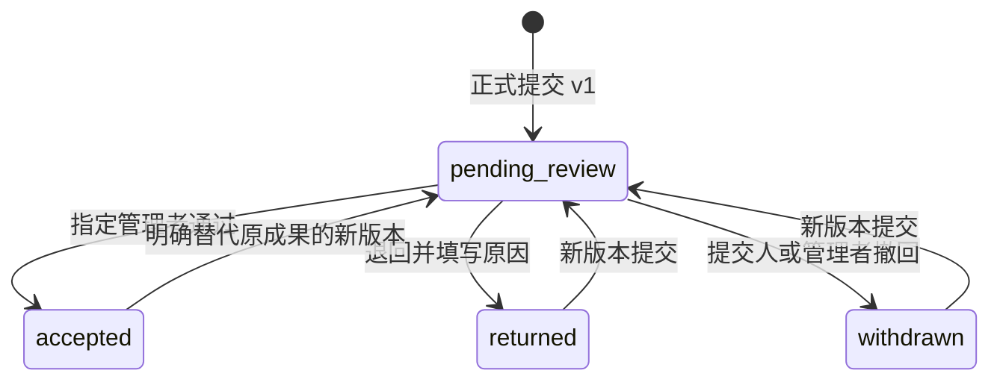

# 第二批：统一任务、对象授权与交付管理设计

日期：2026-09-22；状态：已完成实现与验收。范围：LP-06、07、09、10、12、13、15及配套 LP-19。
最终全量 852 项测试、生产构建、交叉复审和隔离浏览器验收通过；证据及环境边界见[第二批验证记录](../../validation-2026-09-22-delivery-management.md)。

共同合同见[总体设计](2026-09-22-lab-planning-optimization-design.md)。按“权限 → 交付/责任 → 待办聚合”交付小增量；统一入口、进展呈现与草稿比较可并行。

## 1. LP-06 统一任务详情

复用 `WorkTaskPanel`，提升为全局详情宿主；保留 `WorkRegisterEditor` 和周记录表单的提交逻辑。各页面调用统一导航意图：`openTask({taskId, section, weeklyRecordId?, returnContext?})`。入口来自清单、概览、周计划或钉钉，只影响定位，不产生第二条任务。

详情头部显示任务编号、整体状态、责任人、截止日期、当前月目标、来源和作废信息。下方采用六个区：

| 区域 | 内容与主动作 |
| --- | --- |
| 概要 | 预期交付、总体说明、最新执行、下一步；编辑总体信息 |
| 周执行 | 各周承诺、阶段成果、正式提交/审核信息；更新所选周 |
| 交付验收 | 按成果项组织各次提交和决定；提交验收/通过/退回 |
| 支持与决策 | 技术阻塞、协调人、回应期限和决策结果；指派/回应/决策 |
| 催办与延期 | 既有回应、申请和审批；继续复用原接口 |
| 历史 | 来源链、进展、关联变化、期限、成果版本和作废记录 |

新增通用 `GET /api/tasks/:id/view`，共享现有 `CollaborationService.taskView()` 的投影逻辑；旧 `/collaboration/tasks/:id` 保留适配，避免立即破坏深链接。响应包括安全对象投影、关联记录摘要、`allowedActions` 与 `readOnlyReason`；历史分页按需读取，不一次返回所有审计。

基础详情与编辑不依赖协作总开关；催办和外发按原开关控制。深链接的 section、weeklyRecordId 必须白名单校验，所选周记录必须属于该任务且当前用户可读。桌面复用弹窗/侧面详情，移动端全屏；关闭返回原筛选、周期和滚动位置。作废对象通过授权历史入口只读展示。

## 2. LP-07 总体说明与最新执行

清单读模型分成两项，不再通过 `currentProgress || weekly.actualOutcome` 选一个覆盖另一个：

- `overallProgress`：`text、changedAt|null、evidenceRef|null`，表示任务总体说明。
- `latestExecution`：`text、sourceType、sourceId、weekStart?、occurredAt|null、recordedAt|null、actorId、proxy、evidenceQuality`，表示最近实际执行事实。

新记录通过基础业务层记录字段真实变化，复用 `ProgressEvent` 的语义和字段，避免创建第二套进展时间轴。将事实写入从协作开关外执行，将消息派生保留在开关内；同一命令涉及任务和周记录时按原命令去重。标题、优先级、月目标关联变化不刷新进展时间；“暂无新进展”的回应可进入回应历史，但不刷新实质进展时间。

“总体说明”展示 currentProgress 的字段变更时间；“最新执行”在任务实质进展、已发生周成果中选择有效的最新事件，按实际发生时间、记录时间、ID 稳定排序。允许服务端认可的代录时间并显示代录标记；未来周承诺不是执行成果。已删除周记录不进入当前最新执行，历史入口仍保留。

存量按可验证的字段审计重建，质量标为 `audit_reconstructed`；没有依据的内容标为 `unknown`，显示“历史更新时间不明”，不与精确事件假装精确排序。可单列“历史执行记录”，不能用 Task.updatedAt 或读取时间排到最新。新周成果不覆盖总体说明。

## 3. LP-12 角色和对象授权

### 3.1 权限模型

新增 `observer`，由管理者创建；现有 member/manager 行为保持兼容。用统一的 `canReadObject / projectObject / canPerformAction` 执行服务端授权。`own()` 当前只检查“manager 或本人”，必须加入业务写能力检查：observer 即使曾为 owner 也不能创建、修改、提交或批准业务对象。检查同时覆盖路由与直接业务服务调用。

新增 `ObjectGrant`：`subjectId、objectType、objectId、capabilities、historyPolicy、grantedBy、grantedAt、expiresAt|null、revokedAt|null、reason、version`。

- 第一版对象：任务、项目摘要、授权报告；能力：read、read_evidence、export_summary。
- `historyPolicy` 默认 `current_onward`：授予时保存对象版本和历史边界，允许读取当前及之后可见内容；更早的周记录、提交和历史需要显式选择 `all_history`。当前状态本身可包含已有事实，授权预览须展示这一点。
- 对象授权不沿关系自动传播。任务授权只允许最小月目标/项目引用；项目摘要授权不包含全部任务；授权报告不授予原报告、模板和素材访问。
- observer 采用独立 bootstrap 和列表投影，只返回本人、授权对象及必要的姓名引用，不沿用现有 member 的全项目/年度目标/用户字典。

| 能力 | member | manager | observer |
| --- | --- | --- | --- |
| 个人任务与周执行 | 本人，沿用现有规则 | 部门管理范围 | 仅明确授权的只读投影 |
| 提交个人成果 | 本人 | 本人或说明原因代交 | 不允许 |
| 验收成果 | 不允许 | 被指定且非本人交付 | 不允许 |
| 月目标/周审核/延期审批 | 沿用现有权限 | 沿用现有权限 | 不允许 |
| 处理支持事项 | 本人或明确分派的该事项 | 部门范围 | 不允许 |
| 部门报告与迁移包 | 沿用原规则 | 沿用原规则 | 不允许 |
| 授权摘要及证据 | 沿用原规则 | 可管理授权 | 需对应 capability |
| 人事反馈、绩效记录 | 本人相应对象 | 管理范围 | 任务授权不包含这些内容 |

### 3.2 安全投影与撤销

任务安全投影默认包含标题、责任人、承诺、总体/公开执行摘要、交付状态；默认不含未提交个人草稿、完整审计 before/after、代录私密原因、反馈、其他成员月提报原文。任务历史能力也只提供可见事件投影，不直接暴露审计原对象。

项目摘要只统计授权任务，标明“授权范围内”；未授权依赖可显示“存在不可见的前置事项”，不暴露名称与责任人。需要部门总口径时由管理者单独发布摘要。附件下载先检查父业务对象，再检查附件归属和 read_evidence；外部证据链接的目标访问权限由外部系统管理，不承诺应用能代为保护或撤回。

授权 API：`POST /api/object-grants`、`POST /api/object-grants/:id/revoke`，管理者操作，包含 requestId 和相关版本；重复授权明确更新已有授权，不叠加无效副本。读取入口 `GET /api/authorized-work` 和 `GET /api/authorized-work/:id`；`GET /api/tasks/:id/view` 对 observer 复用同一个安全投影器。

原 `/reports`、`/report-agent` 素材和迁移导出继续按原权限。授权摘要采用独立 `ScopedReport`：对象版本清单、接收人、重新生成的摘要正文、证据引用、定稿时间和哈希。不能只裁剪 snapshot 却保留原全部门正文。凡含一项已撤权来源的旧摘要，在线读取整体拒绝并提示管理者生成新版本；冻结字节不在读取时静默改写。

读取 ScopedReport 需要同时满足报告本身的 read 授权及每条来源事实在当前有效来源授权范围内。来源 manifest 必须记录对象 ID、版本、所含历史事实 ID/发生时间；逐条应用 historyPolicy，未知历史边界按不可读取处理。撤权后重新授予 current_onward 不会恢复对旧 all_history 摘要的访问；必须显式重新授权相应历史范围或生成只含新范围的摘要。下载证据与导出还分别检查 read_evidence、export_summary；报告授权不是来源授权的替代品。

授权撤销、过期、用户停用后，下次列表/详情/附件/导出/发送均重新校验。排队发送取消；客户端清理相关缓存。旧链接不构成授权，完整备份保留事实也不绕过当前访问检查。已送达或下载副本不可追回。

## 4. LP-13 个人成果交付与验收

### 4.1 对象和状态

使用三种小对象，让每次提交不可变、当前状态可并发保护：

| 对象 | 核心字段 | 责任 |
| --- | --- | --- |
| DeliverySeries（交付项） | id=deliverableKey、taskId、title、reviewerId|null、headSubmissionId、status、version | 稳定成果身份和当前状态；第一版每任务默认一项，确有不同成果可显式新增 |
| TaskDelivery（提交版本） | seriesId、revision、supersedesId、taskVersion、ownerId、submittedBy、proxyReason、submittedAt、actualOutcome、evidenceRefs、acceptanceCriteriaSnapshot、reviewerIdSnapshot、dueDateSnapshot、deadlineBasisRefs | 每次正式提交冻结；返工产生下一版本 |
| DeliveryDecision（决定） | deliveryId、conclusion、note、decidedBy、decidedAt、supersedesDecisionId? | 验收、退回、撤回及明确更正的不可变证据 |

交付项状态为 `pending_review / accepted / returned / withdrawn`；尚未正式提交时仅有现有表单草稿，不伪造提交事实。提交后的内容不可编辑；待验收时可由提交人或管理者说明原因撤回，再交新版本。退回必须说明原因；验收通过要求简短验收结论。验收人不可同时是该交付 owner；管理者代交不改变实际责任人。

已通过后新增版本须明确选择“替代原成果”，旧通过记录保留，当前项重新待验收；补充材料不改变原冻结提交，可作为有时间的补充记录，影响验收内容则需新版本。误操作更正通过有验收权限的管理者新增带理由的 supersedes 决定，不覆盖原决定。只有更正 headSubmissionId 对应的当前决定才重新计算交付项状态；更正历史 v1 不改变当前 v2 的状态，只更新该历史版本的有效决定并标记影响。原决定、原验收时间一直可查。

### 4.2 接口与事务

- `GET /api/tasks/:id/deliveries`：交付项和当前版本摘要，历史按项分页。
- `POST /api/tasks/:id/deliveries`：`requestId、taskVersion、seriesId?、seriesVersion?、previousRevision、actualOutcome、evidenceRefs、acceptanceCriteria、reviewerId`。首交创建项与 v1 同事务；续交必须基于当前项版本和上一提交 ID。
- `POST /api/deliveries/:id/decisions`：`requestId、seriesVersion、action、conclusion?、note、supersedesDecisionId?`。action 为 review/withdraw/correct；review 仅作用于该项当前待验收版本。
- `POST /api/delivery-series/:id/reassign`：管理者、当前版本、原因和新验收人；保留原指定快照，记录有效验收人变化。

验收判断当前有效指定人和账号状态；验收人停用后保持待办并转管理者待分派，不自动改人或通过。review 和产生 accepted/returned 的 correct 都要求当前有效指定验收人、有效 manager 且非该提交 owner；普通 manager 须先经有理由的重新指派，不能绕过此规则直接更正。withdraw 仅允许当前待验收提交的提交人或管理者，correct 不将已决定的版本改为 withdrawn；需要撤销通过时用有理由的 returned 更正。由 DeliverySeries.version 进行 CAS，解决同一提交重复验收、撤回与验收竞态；不可变提交本身的 version 不承担状态锁。每个提交最多一个有效终局决定，更正通过 supersedes 链表达；只允许对所选提交的当前有效决定更正。

成果最小必填：成果说明、非空验收标准；存在符合非本人规则的有效管理者时必须选择验收人。服务器确认没有合资格验收人时允许 reviewerId=null 正式提交，保留真实提交时间，状态为 pending_review，界面显示“待指定验收人”并进入管理者待分派区；没有指定人时不能验收。证据可采用已有链接或明确文本证据，不强制每项工作上传文件。第一版不新增通用文件平台；后续增加平台附件时必须按父对象权限保护。提交、项状态、审计、通知、命令回执原子写入，网络失败同请求重试。

### 4.3 与已有状态及时间的关系

提交验收、通过、退回均不静默改变 Task.status，不代替月目标验收和周提报。表单可提供明确的“同时标记任务自报完成”，执行第一批完成规则并校验任务版本。退回后提示更新任务执行状态，由用户确认具体动作。

同时展示首次提交时间、当前/最终通过版本的提交时间、验收时间和验收等待时长。首次提交按时不自动等于成果按时达标；最终通过版本的提交时间用来判断达标交付是否按时，验收人较晚处理不计为成员迟交。无最终通过版本时展示“提交及时性”和“质量待确认”，不生成按时完成率。

deadlineBasisRefs 保存当时有效承诺及批准变更引用，第三批保留所有历史逾期区间。已有完成说明只显示“历史自报完成，无独立验收记录”，不补造通过记录和提交时间。跨周、跨月、返工不会改变 deliverableKey，档案按交付项归集一次。

## 5. LP-15 支持与决策责任

复用 `BlockerEpisode / BlockerAction`，增加 `coordinatorId、responseDueAt、coordinationState、responseNote`。状态为待分派、待回应、处理中、已回应、管理关闭；保留原技术解除的 resolvedAt/resolvedBy，以及独立的 managementClosedAt。管理关闭不更改任务 blocked 状态。

管理者指派或转派协调人；协调人可以回应、记录处理进度和建议复查日期。普通成员若不是任务 owner，只获得该阻塞的必要标题、原因、影响和诉求，不获得任务全详情、其他人的周草稿或任务编辑权。处理接口检查具体 assignee，不用临时提升为 manager。观察者不参与写操作。

扩展 `POST /api/blockers/:id/handle`，新增 `POST /api/blockers/:id/assign`，都携带对象 version 和 requestId。管理者可接受延期复查或管理关闭；技术解除继续由执行人更新实际工作状态，记录独立解除事件。协调人停用时进入管理者“待重新指派”，保留过去的责任记录。

增加 `DecisionRequest`：`taskId、blockerEpisodeId?、question、options、decisionOwnerId、responseDueAt、status、result、decidedAt、decidedBy、version`。状态 open/decided/cancelled；管理者指定有效 manager 为决策责任人，observer 默认只读不充当决策处理人。API 为 `POST /api/decision-requests`、`POST /api/decision-requests/:id/decide`、`POST /api/decision-requests/:id/reassign`；取消/重新开启记录明确原因和新的业务代次。

`decisionNeeded` 原文继续保存，界面提供“转为决策事项”并让用户确认责任人和期限，不按姓名猜账号。阻塞阶段和责任持久化移至协作开关外；催办、升级和外发仍受开关约束。存量 blocked 仅在确认纳入支持流程时生成阶段，发生时间未知就标未知。

## 6. LP-09 待我处理

首页采用业务投影，不新建可以手动打勾完成的第二份待办实体。响应 `ActionItem` 包含：`key=kind/sourceId/businessGeneration、kind、sourceId、sourceVersion、taskId?、assigneeIds、title、requiredAction、dueAt?、actionTarget、blockedReason?`。

| 类别 | 生成条件 | 处理入口 |
| --- | --- | --- |
| 月目标待审核 | status=submitted 且用户可审核 | 原月审核表单 |
| 月成果待验收 | 已发布且 acceptanceStatus=submitted | 原月成果验收 |
| 周计划待审核 | 最新有效整份提交可审核；变更后需重提的不显示“直接批准” | 周提报审核 |
| 个人成果待验收 | 当前交付项 pending_review 且用户为有效验收人 | 交付详情 |
| 延期待批准 | 申请 open 且仍符合审批规则 | 原延期审批 |
| 催办待回应 | 本人 open 催办 | 原回应表单 |
| 支持/决策 | 分派给本人且尚需动作，或复查时间已到 | 支持/决策区域 |
| 待分派/需恢复 | 未指定或责任人失效，或处理开关关闭 | 管理者分派/恢复入口 |

`GET /api/my-actions?kind=&cursor=&limit=` 返回 items、分类 counts、nextCursor、asOf；默认 30、最大 100。先授权，再按业务条件汇总和分页。分类计数覆盖完整授权集合，不受当前页限制。待办按逾期、期限、创建时间、ID 排序，游标绑定账号、筛选与权限版本。

待审核未指定到个人时是管理者共享队列，允许多名管理者看到；实际动作依靠版本校验，只能一个有效处理。列表明确“管理队列”，不声称已个人分派。支持延期复查后移到“待复查”区，到期再回“需处理”；已回应不代表技术阻塞解除，继续在任务风险区域展示。

“待协调”指标点击打开对应业务条件列表。消息查看、已读、送达均不减少待办。没有通用 completeAction 接口；处理调用原业务服务后失效相关查询。处理中发生冲突显示当前决定，保留输入；作废任务退出当前行动，不删除历史申请。

## 7. LP-10 版本冲突与草稿恢复

沿用 `use-form-draft` 与现有 7 天会话草稿，不另建云端草稿系统。schema 3 保存：`userId、entityType、entityId、formId、baseVersion、baseValues、values、savedAt、formSchemaVersion、operationEpoch`；建立按账号、对象、表单的发现索引，以找到旧版本草稿。身份或对象不匹配禁止恢复。

只对 `409 VERSION_CONFLICT` 开启三方比较。`TASK_CANCELLED`、`IDEMPOTENCY_MISMATCH`、权限失效等显示对应原因，不误当可合并字段冲突。授权读取接口提供当前可编辑投影，通用 Store 不在错误里附带完整业务对象。

设开始编辑值 B、服务器当前值 S、本地值 L：

| 条件 | 默认选择 |
| --- | --- |
| L=B | 采用服务器 S |
| S=B | 保留我的 L |
| L=S | 直接一致 |
| 双方修改且不同 | 逐字段展示 B/S/L，用户选择 |

状态与完成说明、阻塞字段、人员集合等关联字段按规则组选择，再执行完整业务校验，不做逐字符拼接。用户可查看差异后取消、复制文本或确认合并；确认后使用最新服务器版本和新命令 ID。若再次冲突继续比较，不提供强制覆盖。

旧 schema 2 缺 baseValues，仅提供双栏比较，不能伪造基线。无权限时不展示服务器内容，也不把旧草稿带到其他账号；同一账号已作废对象的本地输入可复制但不可提交。保存成功才清除该次草稿，网络不确定、409、存储失败/配额超限均明确提示并尽可能保留当前输入。

## 8. 迁移、验收与实现边界

新增对象同步更新严格导出 schema、集合/字段白名单、用户映射、引用完整性、账号删除阻断和整库备份测试。普通业务包不自动恢复授权和订阅；交付项、提交、决定、支持/决策记录按依赖闭包迁移，新格式见总体设计。新角色在所有写门禁和投影完成前不开放创建。

| 需求 | 本批关键验收 |
| --- | --- |
| LP-06 | 四个入口看到同一对象；选择周状态独立；协作关闭基础编辑可用；作废只读 |
| LP-07 | 新周成果不被旧总体说明遮挡；只改标题不改进展时间；历史未知如实显示 |
| LP-09 | 数量与真实状态一致；已读不消失；共享审核只能成功一次；跨期事项不漏 |
| LP-10 | 同字段冲突需确认；不同字段可合并；再次冲突不丢输入；旧版草稿可发现且不跨账号 |
| LP-12 | observer 直接接口写入失败；列表/统计/引用/历史/附件/导出不越权；撤权旧链接失效；member 原历史投影不退化 |
| LP-13 | 按时提交、晚验收不算成员迟交；撤回/验收竞态一个胜出；返工留旧版本；禁止自验收；失效验收人需重派 |
| LP-15 | 指定协调人收到准确待办；普通协调人只能看最小上下文；管理关闭不解除技术阻塞；关协作不丢责任记录 |

浏览器主路径：成员从清单打开任务→提交成果→指定管理者从待我处理验收→成员查看版本与结论；另验收并发编辑、领导授权与撤销、阻塞指派及回应。需要保留“周完成≠任务完成≠成果通过≠月验收”的可见差异。
