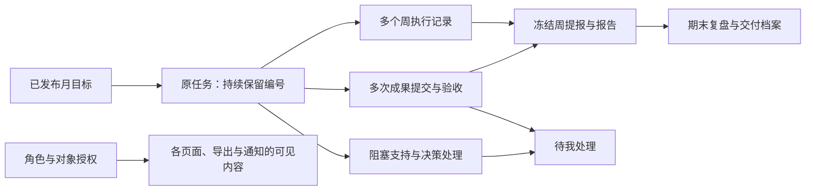

# 实验室计划与交付：20 项优化总体设计

日期：2026-09-22
状态：分批实施中；第一、二批已完成并部署生产；第三批已完成开发及本地验收，尚未部署；第四批保留设计规格。当前证据统一见[功能状态台账](../../feature-status.md)。
第一批结果见[验收记录](../../validation-2026-09-22-consistency.md)。
源码基线：本地 `lab-planning` 仓库 `main`，`2dae9c9`。
需求依据：用户提供的 LP-01～LP-20 优化清单。本设计逐项响应，并纳入该基线已有的任务作废规则。

## 1. 设计结论

保留 React / TypeScript / Express / SQLite 单实例架构，以“一个任务、多个执行周期、可追溯的成果提交、明确的处理责任”为主线分批增强。首先修正数据与规则一致性，再建立对象授权、个人交付验收和待我处理，之后优化跨期与历史口径，最后扩展向上协同和成员评价。

本设计由多份规格组成，每批独立细化实施计划、开发和验收，不将 20 项打包成一次大版本切换。用户已授权开始实施，第一批按上述记录完成。

| 方案 | 适用收益 | 代价与取舍 |
| --- | --- | --- |
| **推荐：现有系统分批增强** | 复用任务面板、版本保护、审计、通知、周提报与报告快照，逐批交付 | 需要先明确授权、事务、时间口径等共同合同 |
| 仅修正前五项 | 最快降低已定位的一致性风险 | 仍无法解决领导授权、个人交付验收和管理待办，仅适合作为第一批 |
| 重建独立项目/绩效平台 | 可重新组织全部模型 | 迁移、重复台账和上线成本高，当前没有支撑重建的测量依据 |

## 2. 评审采用的业务默认值

- 保留单部门、单实例；管理者和成员现有权限不扩大。新增观察者账号仅查看明确授权内容，由管理者创建或调整，不通过普通注册直接获得。
- 任务仍由一名成员承担主要执行责任；协调人、验收人、交办人和对上负责人分别记录，不能相互推断。
- 个人成果第一版由有权限的管理者验收；成员和观察者不自行批准成果。管理者本人交付不能由本人验收；没有其他可用管理者时显示待指定验收人，不自动通过。
- “完成本周”“整个任务自报完成”“个人成果验收通过”“月目标验收通过”“周报正式提交”是独立事实。
- 领导只读、正式汇报确认后发送、绩效先建交付档案，这三项是本提案的默认产品决策，可在评审时调整。

## 3. 业务结构与使用入口

首页保留现有部门概览，在首屏加入“待我处理”：类型、事项、发起人、待处理时间、期限和处理按钮。点击进入原业务对象，处理后按真实业务状态退出待办。

同一个任务从清单、部门概览、周执行、催办或钉钉进入时，打开同一个详情容器。容器包括“概要、周执行、交付验收、阻塞与决策、变更历史”；携带来源上下文定位相应区域，返回后保留原筛选和滚动位置。移动端采用全屏详情，沿用现有设计语言，不增加另一套大屏。

任务卡同时显示整体执行状态和最近周状态；总体说明与最新执行各占独立信息位。待验收/退回等交付状态另行标识，避免将一个状态字段承担所有业务含义。

## 4. 分批设计与全部需求映射

| 需求 | 性质与优先级 | 设计决策 | 规格 |
| --- | --- | --- | --- |
| LP-01 未完成原因 | 修复 / P0 | 服务端按验收结论校验必填，结果和审计同事务 | [第一批](2026-09-22-lab-planning-consistency-design.md#lp-01-月度未完成原因) |
| LP-02 交办来源继承 | 修复 / P0 | 明确承接字段白名单，重置审核和成果，不复制导入凭证 | [第一批](2026-09-22-lab-planning-consistency-design.md#lp-02-跨月字段继承) |
| LP-03 承接幂等与版本 | 修复 / P0 | 操作回执、来源版本与内容指纹；允许显式拆分 | [第一批](2026-09-22-lab-planning-consistency-design.md#lp-03-跨月承接命令) |
| LP-04 基础规则统一 | 修复 / P0 | 完成、阻塞校验进入业务层，协作开关只影响协作行为 | [第一批](2026-09-22-lab-planning-consistency-design.md#lp-04-统一基础校验) |
| LP-05 刷新乱序 | 修复 / P1 | 身份代际、读取序号和写入屏障共同保护页面 | [第一批](2026-09-22-lab-planning-consistency-design.md#lp-05-异步页面一致性) |
| LP-06 统一详情 | 整合 / P1 | 复用 WorkTaskPanel 和已有编辑器、处理接口 | [第二批](2026-09-22-lab-planning-delivery-management-design.md) |
| LP-07 两类进展 | 优化 / P1 | 总体说明和实际执行分栏，采用字段级进展时间 | [第二批](2026-09-22-lab-planning-delivery-management-design.md) |
| LP-08 跨期连续流程 | 优化 / P1 | 可恢复向导，发布为独立关卡，确认后事务化关联与排周 | [第三批](2026-09-22-lab-planning-cross-period-design.md) |
| LP-09 待我处理 | 整合 / P1 | 按业务待处理状态投影，计数与列表同源 | [第二批](2026-09-22-lab-planning-delivery-management-design.md) |
| LP-10 冲突恢复 | 优化 / P1 | 同账号对象草稿索引、三方字段比较、确认后新命令提交 | [第二批](2026-09-22-lab-planning-delivery-management-design.md) |
| LP-11 历史复盘 | 新增 / P1 | 当前视图与历史事实分开，未知时间明确显示 | [第三批](2026-09-22-lab-planning-cross-period-design.md) |
| LP-12 对象授权 | 新增 / P1 | observer 加对象授权与安全投影，覆盖列表、详情、附件、导出、通知 | [第二批](2026-09-22-lab-planning-delivery-management-design.md) |
| LP-13 个人交付验收 | 新增 / P1 | 不可变提交、验收决定和成果修订链，提交与验收时间分开 | [第二批](2026-09-22-lab-planning-delivery-management-design.md) |
| LP-14 交办与订阅关系 | 扩展 / P2 | 明确账号关系，复用摘要和发送队列，正式汇报人工确认 | [第四批](2026-09-22-lab-planning-leadership-performance-design.md) |
| LP-15 协调与决策责任 | 扩展 / P1 | 在现有阻塞事件上增加责任与期限，独立记录处理和解除 | [第二批](2026-09-22-lab-planning-delivery-management-design.md) |
| LP-16 里程碑与依赖 | 新增 / P2 | 项目里程碑、交付引用和无环依赖，年度方向可选 | [第四批](2026-09-22-lab-planning-leadership-performance-design.md) |
| LP-17 成员交付档案 | 新增 / P2 | 按成果责任去重汇总，再增加规则版本、评价、反馈和定稿 | [第四批](2026-09-22-lab-planning-leadership-performance-design.md) |
| LP-18 查询性能 | 优化 / P1 | 先记录基线，再拆初始化、按权限查询分页、按需读取正文 | [第三批](2026-09-22-lab-planning-cross-period-design.md) |
| LP-19 关键回归 | 工程 / P1 | 各批验收进入已有 CI，保留容器、备份和持久化验证 | 各批规格及下文 |
| LP-20 发布状态与实机验收 | 工程 / P1 | 建立带证据的四维状态台账，真实环境逐能力验收 | [第三批](2026-09-22-lab-planning-cross-period-design.md) |

依赖关系：第一批 → 第二批中的权限、交付、待办；跨期向导依赖第一批承接合同；历史复盘依赖交付与期限事实；领导订阅依赖对象授权；正式评分必须等待权限、交付验收、历史复盘和档案稳定。LP-18 的基线测量与 LP-20 的资料核对可从第一批并行开始。

## 5. 跨模块工程合同

### 5.1 原子写入与幂等

涉及多对象的命令必须在现有同步 `Store.transaction()` 中完成：读取权限和版本、校验业务条件、写业务对象、审计、站内通知/外发队列、命令回执。事务内不调用网络、不使用异步函数；外发由提交后的现有 worker 完成。

命令回执由操作类型、当前操作者、客户端 `requestId` 唯一定位。内容指纹使用标准化后的业务请求，包含基础版本。成功重试先重新核对当前授权，再匹配回执，匹配后返回原操作标识与当前可见状态；不能因为对象后来升级版本而重复执行。相同键用于不同内容返回 409；失败事务不留成功回执。客户端命令号与服务端诊断 `X-Request-Id` 分开。

错误统一扩展为 `{error, code?, requestId, fieldErrors?}`，兼容现有 `error` 文本；版本冲突返回 409，字段校验返回 400。不可见对象读取返回 404；显式禁止的写动作返回 403。错误中不附带未经授权的服务器完整对象。

### 5.2 当前状态、历史事实与时间

存储时间采用规范 UTC，界面和业务日期采用 Asia/Shanghai。日期型任务期限统一转换为该日后一天北京时间 00:00 的排他边界；现有周五 16:00 提报边界维持不变。服务器接收时间用于正式提交，浏览器时间不能决定是否按时。

新增事实记录包含业务发生时间、系统记录时间、操作者和来源版本。不能用任务 `updatedAt` 推断进展发生时间、完成时间或验收时间。历史缺少依据时保留“未知”；人工补证据形成新增更正记录，不伪造原系统提交时间。

### 5.3 存量兼容与数据转移

旧任务、已删除周安排、已作废任务、定稿报告均保持原事实。作废任务不进入当前待办、跨期、催办和绩效完成数；获得历史读取权限的用户仍可查看适当历史。新增交付后，任务作废若存在待验收提交应被阻止，需先按明确理由撤回提交；已验收成果可保留，并在档案中同时展示任务后来作废的事实，不能靠作废删除已发生的成果。

SQLite 当前存储版本为 2，业务迁移包当前支持 v1～v4，这两个版本号不能混用。结构与索引变化采用顺序存储迁移；新增业务集合进入下一业务包版本（本设计预留 v5，实施时核对是否被其他工作占用），继续接受 v1～v4，禁止静默丢弃新数据导出旧格式。

完整备份保存所有对象。业务包包含成果、审查事实、历史承诺和里程碑等业务记录；账号授权、订阅配置、命令回执与运行中向导不通过业务包自动恢复，必须在目标环境显式重建或重新确认。恢复不发送消息；身份引用映射、删除阻断和引用完整性检查必须同步增加。旧包不自动生成“已验收”或“按时”事实。

### 5.4 授权先于投影和统计

服务端先确定当前可见范围，再筛选、汇总和分页。UI 的 `allowedActions` 只用于呈现按钮，接口必须再次校验。隐藏菜单、知道记录 ID、持有通知链接或已看过历史报告都不构成永久授权。

授权变更递增用户可见范围版本，客户端清除相关查询缓存和未授权详情。导出、附件下载、AI 汇报输入及外发发送前重新检查当前权限。已下载文件或已送达外部消息无法追回，系统不得宣称撤销授权能收回这些副本。

## 6. 实施落点与完成门槛

保留 `Domain` 门面和现有 HTTP 路由，不把所有逻辑继续堆进 `domain-work.ts`。实施时按职责增加小模块：工作基础规则、对象访问策略、交付服务、待办查询、跨期操作、历史事实投影。文件名可随项目惯例调整，对外合同应保持一致。

| 批次 | 可演示结果 | 进入下一阶段前的门槛 |
| --- | --- | --- |
| 1 一致性修复 | 空原因被拒绝；重试只承接一次；页面不回退旧数据 | 五项定向回归、现有测试与构建通过 |
| 2 交付与管理 | 同一任务统一查看；提交成果可验收；有责任人的待办；领导按范围只读 | 权限矩阵、并发编辑、成果版本和提交时间全部验收 |
| 3 跨期与历史 | 中断可续接；期末事实可解释；历史增长不拖累初始化 | 跨期恢复、冻结历史、规模测试、发布状态证据齐备 |
| 4 向上协同与档案 | 领导订阅授权事项；里程碑可定位依赖；个人档案可追溯 | 发送确认、撤权、去重计功、反馈与定稿验收 |

LP-19 随每批实施：修复测试必须能证明旧行为失败、新行为通过；新能力测试针对业务合同。浏览器覆盖真实用户路径，纯源码字符串断言不能替代交互验证。保留 `.github/workflows/ci.yml` 已有的测试、构建、容器、在线备份及持久化重启检查。

本次仅静态核查和设计评审，不以仓库内既有验收记录推断当前生产状态，不以本设计替代真实钉钉或异机恢复验收。

## 7. 核查依据

- `server/domain-plans.ts`：月目标创建、成果验收和跨月承接。
- `server/domain-work.ts`、`server/collaboration-hooks.ts`：任务、周记录和协作校验。
- `server/store.ts`、`server/storage-migrations.ts`：同步事务、版本保护和存储升级。
- `server/domain.ts:58`：全量初始化及历史任务回补。
- `shared/types.ts`、`shared/collaboration.ts`：现有角色、任务、报告和阻塞模型。
- `server/data-transfer-schema.ts`：严格业务包格式与用户引用映射。
- `src/App.tsx`、`src/pages/WorkFollowups.tsx`、`src/components/WorkTaskPanel.tsx`：读取与任务入口。
- `docs/superpowers/specs/2026-09-22-task-cancellation-design.md`：任务作废语义。
- `README.md` 与 `docs/dingtalk-collaboration-operations.md`：发布说明存在需要统一的表述；当前真实开关仍需实际核验。
